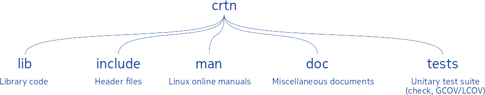

# CoRouTiNe API (CRTN)

[1 Introduction](#1_Introduction)  
[2 Maintainers](#2_Maintainers)  
[3 Download ](#3_Download)  
[4 Administation with cmake ](#4_Adm_cmake)  
&nbsp;&nbsp;&nbsp;&nbsp;[4.1 Configuration](#4_1_Cfg)  
&nbsp;&nbsp;&nbsp;&nbsp;[4.2 Build](#4_2_Build)  
&nbsp;&nbsp;&nbsp;&nbsp;[4.3 Tests](#4_3_Tests)  
&nbsp;&nbsp;&nbsp;&nbsp;[4.4 Tests coverage measurement](#4_4_Tests_coverage)  
&nbsp;&nbsp;&nbsp;&nbsp;[4.5 Packaging](#4_5_Packaging)  
[5 Administration with crtn_install.sh](#5_Adm_script)  
&nbsp;&nbsp;&nbsp;&nbsp;[5.1 crtn_install.sh script](#5_1_crtn_install_sh_scritpt)  
&nbsp;&nbsp;&nbsp;&nbsp;[5.2 Build, installation, cleanup](#5_2_Build_installation_cleanup)  
&nbsp;&nbsp;&nbsp;&nbsp;[5.3 Tests](#5_3_Tests)  
&nbsp;&nbsp;&nbsp;&nbsp;[5.4 Tests coverage measurement](#5_4_Tests_coverage_measurement)  
&nbsp;&nbsp;&nbsp;&nbsp;[5.5 Packaging](#5_5_Packaging)  
[6 Notes about RPM package](#6_Notes_rpm)  
[7 Notes about DEB package](#7_Notes_deb)  
[8 Documentation](#8_Documentation)  
&nbsp;&nbsp;&nbsp;&nbsp;[8.1 Online manuals](#8_1_Online_man)  
&nbsp;&nbsp;&nbsp;&nbsp;[8.2 Overview of the API](#8_2_API_overw)  
&nbsp;&nbsp;&nbsp;&nbsp;[8.3 Example program](#8_3_Ex_prog)

## <a name="1_Introduction"></a>1 Introduction

CoRouTiNe (`crtn`) is a shared library providing an API which proposes coroutines in C language programs. This is a set of services to manage concurrent execution flows. A coroutine can be suspended or resumed under the control of the user. The underlying operating system have no idea of their existence.

The service is an abstraction layer on top of the GLIBC:

<p align="center"></p>

`crtn` is distributed under the GNU LGPL license.

The current document concerns `crtn` version **0.2.1**.


## <a name="2_Maintainers"></a>2 Maintainers


To report a bug or design enhancement, please contact [Rachid Koucha](mailto:rachid.koucha@gmail.com)


## <a name="3_Download"></a>3 Download

The source code is available on github. Use the following command to clone it:
```
$ git clone https://github.com/Rachid-Koucha/crtn.git
```
To get the source code of the 0.2.1 version:
```
$ cd crtn
crtn$ git checkout tags/v0.2.1
```

The source tree is:

<p align="center"></p>

## <a name="4_Adm_cmake"></a>4 Administration with cmake

### <a name="4_1_Cfg"></a>4.1 Configuration

To configure the package:
```
$ cmake .
-- Configuring CRTN version 0.2.1
The user id is 1000
[...]
```

To configure the package with the optional mailbox and semaphore services:
```
$ cmake . -DHAVE_CRTN_MBX=ON -DHAVE_CRTN_SEM=ON
-- Configuring CRTN version 0.2.1
The user id is 1000
[...]
```

### <a name="4_2_Build"></a>4.2 Build

To launch the build:
```
$ make
[  1%] Building C object lib/CMakeFiles/crtn.dir/crtn.c.o
[  3%] Building C object lib/CMakeFiles/crtn.dir/crtn_mbx.c.o
[...]
```

To clean the built files:
```
$ make clean
```

### <a name="4_3_Tests"></a>4.3 Tests

To launch the regression tests (`check` package must be available on the system):
```
$ tests/check_all
Running suite(s): CRTN tests
100%: Checks: 31, Failures: 0, Errors: 0
```

### <a name="4_4_Tests_coverage"></a>4.4 Tests coverage measurement

To launch the tests coverage with the semaphore/mailbox optional services:
```
$ make clean
$ cmake -DHAVE_CRTN_MBX=ON -DHAVE_CRTN_SEM=ON -DCMAKE_COVERAGE=1 -DCMAKE_BUILD_TYPE=Debug .
-- Configuring CRTN version 0.2.1
CMAKE_C_COMPILER_ID=GNU
-- Appending code coverage compiler flags: -g -O0 --coverage -fprofile-arcs -ftest-coverage
[...]
$ make
-- Configuring CRTN version 0.2.1
CMAKE_C_COMPILER_ID=GNU
-- Appending code coverage compiler flags: -g -O0 --coverage -fprofile-arcs -ftest-coverage
[...]
$ make all_coverage
[...]
Running suite(s): CRTN tests
100%: Checks: 31, Failures: 0, Errors: 0
Capturing coverage data from .
[...]
Overall coverage rate:
  lines......: 95.8% (527 of 550 lines)
  functions..: 100.0% (40 of 40 functions)
Open ./all_coverage/index.html in your browser to view the coverage report.
[100%] Built target all_coverage
```
The resulting _./all_coverage/index.html_ file can be viewed in a browser to get something like this:

<p align="center"></p>


### <a name="4_5_Packaging"></a>4.5 Packaging

To generate the DEB, RPM, TGZ and STGZ packages with the semaphore/mailbox optional services:

```
$ make clean
$ cmake -DHAVE_CRTN_MBX=ON -DHAVE_CRTN_SEM=ON -DCPACK_GENERATOR="DEB;RPM;TGZ;STGZ" -DCMAKE_INSTALL_PREFIX=/usr/local .
$ make clean
$ make
$ make package
[...]
CPack: - package: .../crtn/crtn_0.2.1_amd64.deb generated.
[...]
Pack: - package: .../crtn/crtn-0.2.1-1.x86_64.rpm generated.
[...]
CPack: - package: .../crtn/crtn-0.2.1-Linux-crtn.tar.gz generated.
[...]
CPack: - package: .../crtn/crtn-0.2.1-Linux-crtn.sh generated.
```

## <a name="5_Adm_script"></a>5 Administration with crtn_install.sh


### <a name="5_1_crtn_install_sh_scritpt"></a>5.1 crtn_install.sh script


This shell script is a swiss army knife to make several things. It implicitly uses `cmake`. To display the help, use the `-h` option:

```
$ ./crtn_install.sh -h

Usage:

  crtn_install.sh [-b browser] [-c] [-T|-C] [-d install_dir] [-o MBX|SEM]
                  [-B] [-I] [-U] [-A] [-P RPM|DEB|TGZ|STGZ] [-h]

    -b    : Browser's pathname to display the test coverage HTML results
    -c    : Cleanup built objects
    -C    : Launch the test coverage measurement
    -T    : Launch the regression tests
    -d    : Installation directory (default: /usr/local)
    -P (*): Generate DEB/RPM/TGZ/STGZ packages
    -B    : Build the software
    -I (*): Install the software
    -U (*): Uninstall the software
    -A    : Generate an archive of the software (sources)
    -o    : Add MBX|SEM service
    -h    : this help

   (*) Super user rights required
```

Note that some options require super user privileges. Use `sudo` for example.


### <a name="5_2_Build_installation_cleanup"></a>5.2 Build, installation, cleanup


* To build the library:

`$ ./crtn_install.sh -B`

* If mailbox and/or semaphores are required, add the corresponding option on the command line:

`$ ./crtn_install.sh -B -o mbx -o sem`

* For a complete installation in the default _/usr/local_ subtree (super user rights required):

`$ sudo ./crtn_install.sh -I`

* To uninstall the software (super user rights required):

`$ sudo ./crtn_install.sh -U`

* To cleanup every generated files to go back to original source tree:

`$ ./crtn_install.sh -c`


### <a name="5_3_Tests"></a>5.3 Tests

The regression tests are based on `check` package. The latter must be installed
prior launching the tests.

To trigger the regression tests for the whole software:
```
$ ./crtn_install.sh -T
[...]
100%: Checks: 31, Failures: 0, Errors: 0
```

### <a name="5_4_Tests_coverage_measurement"></a>5.4 Tests coverage measurement

The test coverage measurement requires the `gcov/lcov` packages.

To trigger test coverage measurement for `crtn` (with a display of the result in firefox):

`$ ./crtn_install.sh -C -b firefox`

This shows something like this in the browser:

<p align="center"></p>


### <a name="5_5_Packaging"></a>5.5 Packaging

To make a tar gzip source package, use the `-A` option of `crtn_install.sh`:

`$ ./crtn_install.sh -A`

This makes a `tgz` file of the complete source tree: _crtn_src-0.2.1.tgz_


It is also possible to generate Debian (_deb_), Red-Hat Package Manager (_rpm_), Tar GZipped (_tgz_) and Self Extracting Tar GZipped (_stgz_) binary packages.

To build the packages _tgz_, _deb_, _rpm_... (super user rights required):

`$ sudo ./crtn_install.sh -c -P tgz -P rpm -P deb -P stgz`

This makes the following binary packages:
* _crtn_0.2.1_amd64.deb (deb)_
* _crtn-0.2.1-1.x86_64.rpm (rpm)_
* _crtn-0.2.1-Linux-crtn.tar.gz (tgz)_
* _crtn-0.2.1-Linux-crtn.sh (stgz)_
        

### <a name="6_Notes_rpm"></a>6 Notes about RPM package

To get information on a package file:
```
$ rpm -qp --info crtn-0.2.1-1.x86_64.rpm
Name        : crtn
Version     : 0.2.1
Release     : 1
Architecture: x86_64
[...]
License     : GPL/LGPL
Signature   : (none)
Source RPM  : crtn-0.2.1-1.src.rpm
[...]
Relocations : /usr/local 
Vendor      : Rachid Koucha
URL         : https://github.com/Rachid-Koucha/crtn
Summary     : CRTN (CoRouTiNe API for C language)
Description :
CoRouTiNe API for C language
```
To get the pre/post-installation scripts in a package file:
```
$ rpm -qp --scripts rsys-0.2.1-1.x86_64.rpm
preinstall program: /bin/sh
postinstall scriptlet (using /bin/sh):

#!/bin/sh

INSTALL_PREFIX=/usr/local

FILE=${INSTALL_PREFIX}/lib/cmake/FindRsys.cmake
chmod 644  ${FILE}
[...]
```
To list the files for an INSTALLED package:
```
$ rpm -ql crtn
```
To list the files in a package file:
```
$ rpm -ql crtn-0.2.1-1.x86_64.rpm
```
The required package list of an _rpm_ file could be printed with:
```
$ rpm -qp --requires crtn-0.2.1-1.x86_64.rpm
```
### <a name="7_Notes_deb"></a>7 Notes about DEB package

To get information on a package file:
```
$ dpkg --info crtn_0.2.1_amd64.deb
[...]
 Package: crtn
 Version: 0.2.1
 Section: devel
 Priority: optional
 Architecture: amd64
 Homepage: https://github.com/Rachid-Koucha/crtn
[...]
 Maintainer: Rachid Koucha <rachid dot koucha at gmail dot com>
 Description: CoRouTiNe API for C language
```
To list the files in a package file:
```
$ dpkg -c crtn_0.2.1_amd64.deb
```
To install the content of a package file (super user rights required):
```
$ sudo dpkg -i crtn_0.2.1_amd64.deb
drwxr-xr-x root/root         0 2021-03-12 20:06 ./usr/
drwxr-xr-x root/root         0 2021-03-12 20:06 ./usr/local/
drwxr-xr-x root/root         0 2021-03-12 20:06 ./usr/local/include/
-r--r--r-- root/root      4291 2021-03-12 20:05 ./usr/local/include/crtn.h
drwxr-xr-x root/root         0 2021-03-12 20:06 ./usr/local/lib/
lrwxrwxrwx root/root         0 2021-03-12 20:06 ./usr/local/lib/libcrtn.so
[...]
```
To list the installed packages:
```
$ dpkg -l | grep crtn
ii  crtn  0.2.1    amd64   CoRouTiNe API for C language
```
To uninstall (remove) a package (super user rights required):
```
$ sudo dpkg -r crtn
```

## <a name="8_Documentation"></a>8 Documentation

### <a name="8_1_Online_man"></a>8.1 Online manuals

Once `crtn` is installed, it is possible to access the corresponding online manuals with:
```
$ man 7 crtn       # Overview of CRTN

$ man 3 crtn       # Manual of crtn API

$ man 3 crtn_mbx   # Manual of crtn mailbox service

$ man 3 crtn_sem   # Manual of crtn semaphore service
```
The latters provide some small example programs in their _EXAMPLES_ section.
### <a name="8_2_API_overw"></a>8.2 Overview of the API

A coroutine is created with `crtn_spawn()`.  The latter returns a unique coroutine identifier (cid).

The coroutines have several attributes set with the `crtn_set_attr_xxx()` services:
* Two types of coroutines are provided: `stackless` and `stackful` (default).
* Two scheduling types are provided: `stepper` and `standalone` (default). A stepper coroutine is by default suspended. A standalone coroutine is by default always runnable.

A coroutine suspends itself calling `crtn_yield()`. It is resumed when another coroutine calls `crtn_yield()` if it is standalone or `crtn_wait()` if it is stepper.

A stepper coroutine can pass the address of some data to `crtn_yield()`. The coroutine waiting for it, gets those data with the pointer passed to `crtn_wait()`. 

A coroutine terminates when it reaches the end of its entry point, when it calls `crtn_exit()` or when another coroutine calls `crtn_cancel()` to finish it.

A  terminated coroutine stays in a zombie state until another coroutine calls `crtn_join()` to get its termination status and to implicitly free the corresponding internal data structures.  The latter is an integer with a user defined signification.

The state diagram of a coroutine is depicted in the following figure:

<p align="center"></p>

The scheduling is FIFO oriented. Any coroutine becoming runnable, is put at the beginning of the list. Any running (standalone) coroutine yielding the CPU goes at the end of the list. This minimizes CPU starvation.

Additional inter-coroutine communication and synchronization are optionally provided with the `-o` option of the `crtn_install.sh` script:
- The mailboxes (`crtn_mbx_new()`, `crtn_mbx_post()`, `crtn_mbx_get()`...). They are provided with `-o mbx`;
- The semaphores (`crtn_sem_new()`, `crtn_sem_p()`, `crtn_sem_v()`...). They are provided with `-o sem`.

### <a name="8_3_Ex_prog"></a>8.3 Example program

In the following example, the main coroutine creates a secondary coroutines with the `stepper` attribute and resumes it every seconds. The secondary coroutine generates the following term of the [fibonacci sequence](https://en.wikipedia.org/wiki/Fibonacci_number) each time it is resumed by the main coroutine. The term is passed through `crtn_wait()`. 

```c
#include <errno.h>
#include <stdio.h>
#include <unistd.h>
#include <signal.h>
#include <limits.h>

#include <crtn.h>

static int signaled;

static void hdl_sigint(int sig)
{

  printf("Signal %d...\n", sig);
  signaled = 1;

} // hdl_sigint


static int fibonacci(void *param)
{
  unsigned long long prevn_1;
  unsigned long long prevn;
  unsigned long long cur;

  (void)param;

start:

  cur = prevn_1 = 0;
  crtn_yield(&cur);

  cur = prevn = 1;
  crtn_yield(&cur);

  while (1) {
    // Check overflow
    if ((ULLONG_MAX - prevn_1) < prevn) {
      goto start;
    }
    cur = prevn + prevn_1;
    crtn_yield(&cur);
    prevn_1 = prevn;
    prevn = cur;
  }

  return 0;
  
} // fibonacci


int main(void)
{
  crtn_t cid;
  int rc;
  int status;
  unsigned long long *seq;
  crtn_attr_t attr;
  unsigned int i;

  signal(SIGINT, hdl_sigint);

  attr = crtn_attr_new();
  if (!attr) {
    errno = crtn_errno();
    fprintf(stderr, "crtn_attr_new(): error '%m' (%d)\n", errno);
    return 1;
  }

  rc = crtn_set_attr_type(attr, CRTN_TYPE_STEPPER);
  if (rc != 0) {
    errno = crtn_errno();
    fprintf(stderr, "crtn_set_attr_type(): error '%m' (%d)\n", errno);
    return 1;
  }

  rc = crtn_spawn(&cid, "Fibonacci", fibonacci, 0, attr);
  if (rc != 0) {
    errno = crtn_errno();
    fprintf(stderr, "crtn_spawn(): error '%m' (%d)\n", errno);
    return 1;
  }

  rc = crtn_attr_delete(attr);
  if (rc != 0) {
    errno = crtn_errno();
    fprintf(stderr, "crtn_attr_delete(): error '%m' (%d)\n", errno);
    return 1;
  }

  i = 0;
  while(1) {

    rc = crtn_wait(cid, (void **)&seq);
    if (rc != 0) {
      errno = crtn_errno();
      fprintf(stderr, "crtn_wait(%d): error '%m' (%d)\n", cid, errno);
      return 1;
    }
    printf("seq[%u]=%llu\n", i, *seq);
    i ++;
    sleep(1);

    if (signaled) {
      break;
    }
  } // End while

  rc = crtn_cancel(cid);
  if (rc != 0) {
    errno = crtn_errno();
    fprintf(stderr, "crtn_cancel(%d): error '%m' (%d)\n", cid, errno);
    return 1;
  }

  rc = crtn_join(cid, &status);
  if (rc != 0) {
    errno = crtn_errno();
    fprintf(stderr, "crtn_join(%d): error '%m' (%d)\n", cid, errno);
    return 1;
  }

  return status;

} // main
```
The execution displays:

```
$ fibonacci
seq[0]=0
seq[1]=1
seq[2]=1
seq[3]=2
seq[4]=3
seq[5]=5
seq[6]=8
seq[7]=13
seq[8]=21
seq[9]=34
seq[10]=55
seq[11]=89
seq[12]=144
seq[13]=233
^CSignal 2...
```
Many other example programs are available in the _tests_ sub-directory of the source code tree.
